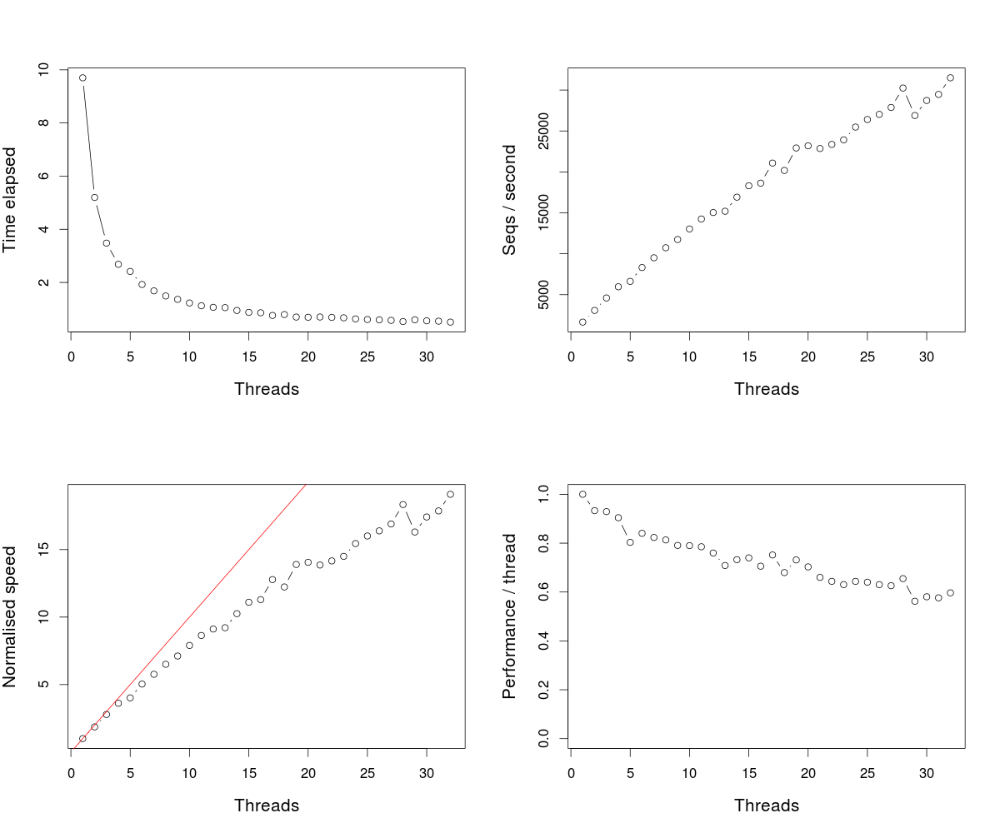

# Sequence alignment implementation for R

These files provide sequence alignment functions which can be run
from R. The primary objective of this is to use R for visualising
alignment statistics to facilitate sane choices for threshold
parameters for tasks such as internal primer discovery.

## Usage
### Compilation
```sh
R CMD SHLIB seq_alignment.c smith_waterman.c

## or for more speed:
MAKEFLAGS="CFLAGS=-O3" R CMD SHLIB seq_alignment.c smith_waterman.c

```

### Library load
Within R:
```R
dyn.load("~/R/seq_alignment/seq_alignment.so") 
```

### Example use
To detect forward and reverse primers in sequences present
in `CCSreads.fastq`.
```R
## Define the primer sequences
p.ff <- "TGGATTGATATGTAATACGACTCACTATAG"
p.fr <- "TCTCAGGCGTTTTTTTTTTTTTTTTTT"
p.bf <- "AAAAAAAAAAAAAAAAAACGCCTGAGA"
p.br <- "CTATAGTGAGTCGTATTACATATCAATCCA"

p.seqs <- c(p.ff, p.fr, p.bf, p.br)

## Read 250 sequences from the 
fastq <- readLines( "CCSreads.fastq", n=1000 )
fastq.id <- fastq[ seq(1, length(fastq), 4) ]
fastq.seq <- fastq[ seq(2, length(fastq), 4) ]

## Load the library functions
dyn.load("~/R/seq_alignment/seq_alignment.so")

## loop through the sequences and visualise the score matrices
## for each one

par(mfrow=c(5,1))
par(mar=c(1, 4.1, 1, 1))
for(i in 1:length(fastq.seq)){
    tmp <- lapply( p.seqs, function(p){
        .Call("smith_water_matrices", c(p, fastq.seq[i]), as.integer(c(4, 4, 5)))
    })
    cmaxes <- sapply( tmp, function(x){
        apply(x[[2]], 2, max) })
    invisible( lapply(tmp, function(x){
        image( t(x[[2]][ nrow(x[[2]]):1, ]), col=rgb(0:255/255, 0, 255:0/255) )
    }))
    plot(1:nrow(cmaxes), ylim=range(cmaxes), type='n', xlab='position', ylab='max score', xaxs='i')
    for(j in 1:ncol(cmaxes))
        lines(1:nrow(cmaxes), cmaxes[,j], col=j, lwd=2)
    abline(h=c(100,90,80))
    inpt <- readline("next: ")
}
```
### A chimeric sequence containing internal primers:
<figure>
	
</figure>

## Performance
Not particularly optimised. Takes on average about 1 millisecond to determine
the matrices for a pair of 30 vs 1500 bp sequences (rough estimates of
sequence length; I didn't check). Note that this includes the R overhead of
calling the alignment function many times.

Using the `smith_water_col_max` function which only returns a matrix of column
max scores for each primer-set sequence pairing and compiling with -O3 (see
above) this is now improved to 0.2 ms per sequence pair. Typically one will have
4 different primer sequences to search for (depending on orientation). Hence
this means that it takes less than a millisecond to return the max_column scores.
This extrapolates to a 1000 seconds for a million sequences, or approximately
16 minutes. 

## Multithreaded version
`smith_water_col_max_mt` uses pthreads to parallelize the `smith_water_col_max` by
splitting the set of sequences across a set of threads. This doesn't give a completely
linear increase in speed, but works reasonable well giving us speeds of up to 30000
sequences (mean length of 1.5 kb) per second, meaning that we can scan about two million
sequences per minute given 32 threads.

### Multi-threading performance
<figure>
	
</figure>

The above figure was created by first extending the sequence set to
one containing 16000 sequences and then running system.time:

```R
fastq.seq2 <- c(fastq.seq, fastq.seq)
for(i in 1:5){
    fastq.seq2 <- c(fastq.seq2, fastq.seq2)
}
## that is now 16000 sequences

mp.performance <- sapply(1:32, function(t){
    system.time( tmp4 <- .Call("smith_water_col_max_mt", p.seqs, fastq.seq2, as.integer(c(4,4,5)), as.integer(t)) )
})

png("thread_performance.png", width=1200, height=1000, pointsize=20)
par(mfrow=c(2,2))
par(cex.lab=1.25)
t.no <- 1:ncol(mp.performance)
plot( t.no, mp.performance['elapsed',], type='b', xlab='Threads', ylab='Time elapsed')
plot( t.no, length(fastq.seq2) / mp.performance['elapsed',], type='b', xlab='Threads', ylab='Seqs / second' )
##
## normalised by 1 thread
p.speed <- 1 / (mp.performance['elapsed',] / mp.performance['elapsed',1])
plot( t.no, p.speed, xlab='Threads', ylab='Normalised speed', type='b' )
abline(0,1, col='red')
##
plot( t.no, p.speed / t.no, type='b', xlab='Threads', ylab='Performance / thread', ylim=c(0,1) )
dev.off()
```

### R and pthreads
There is no particular difficulty in using R and pthreads; however, it seems to be
essential that no built in R functions are called. It is not surprising that calling
functions like `SET_VECTOR_ELT` and `allocMatrix` cause problems as these can
rearrange memory layout. However, it seems that even calling functions that merely
access data, like `VECTOR_ELT` can lead to memory corruption. Hence I have made sure
that neither the child or the parent thread calls such function at any time between
calling `pthread_create` and `pthread_join`.
