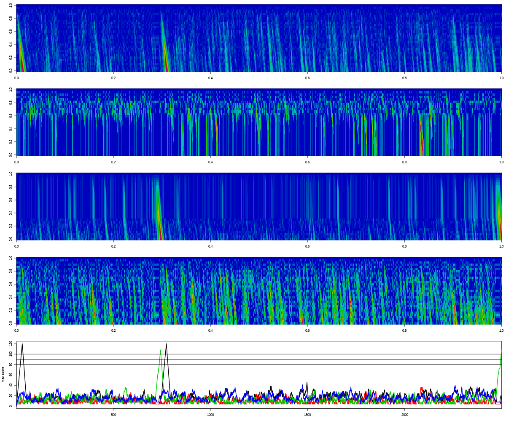

#Sequence alignment implementation for R

These files provide sequence alignment functions which can be run
from R. The primary objective of this is to use R for visualising
alignment statistics to facilitate sane choices for threshold
parameters for tasks such as internal primer discovery.

## Usage
### Compilation
```sh
R CMD SHLIB seq_alignment.c smith_waterman.c
```

### Library load
Within R:
```R
dyn.load("~/R/seq_alignment/seq_alignment.so") 
```

### Example use
To detect forward and reverse primers in sequences present
in `CCSreads.fastq`.
```R
## Define the primer sequences
p.ff <- "TGGATTGATATGTAATACGACTCACTATAG"
p.fr <- "TCTCAGGCGTTTTTTTTTTTTTTTTTT"
p.bf <- "AAAAAAAAAAAAAAAAAACGCCTGAGA"
p.br <- "CTATAGTGAGTCGTATTACATATCAATCCA"

p.seqs <- c(p.ff, p.fr, p.bf, p.br)

## Read 250 sequences from the 
fastq <- readLines( "CCSreads.fastq", n=1000 )
fastq.id <- fastq[ seq(1, length(fastq), 4) ]
fastq.seq <- fastq[ seq(2, length(fastq), 4) ]

## Load the library functions
dyn.load("~/R/seq_alignment/seq_alignment.so")

## loop through the sequences and visualise the score matrices
## for each one

par(mfrow=c(5,1))
par(mar=c(1, 4.1, 1, 1))
for(i in 1:length(fastq.seq)){
    tmp <- lapply( p.seqs, function(p){
        .Call("smith_water_matrices", c(p, fastq.seq[i]), as.integer(c(4, 4, 5)))
    })
    cmaxes <- sapply( tmp, function(x){
        apply(x[[2]], 2, max) })
    invisible( lapply(tmp, function(x){
        image( t(x[[2]][ nrow(x[[2]]):1, ]), col=rgb(0:255/255, 0, 255:0/255) )
    }))
    plot(1:nrow(cmaxes), ylim=range(cmaxes), type='n', xlab='position', ylab='max score', xaxs='i')
    for(j in 1:ncol(cmaxes))
        lines(1:nrow(cmaxes), cmaxes[,j], col=j, lwd=2)
    abline(h=c(100,90,80))
    inpt <- readline("next: ")
}
```
### A chimeric sequence containing internal primers:
<figure>
	
</figure>

## Performance
Not particularly optimised. Takes on average about 1 millisecond to determine
the matrices for a pair of 30 vs 1500 bp sequences (rough estimates of
sequence length; I didn't check). Note that this includes the R overhead of
calling the alignment function many times.
